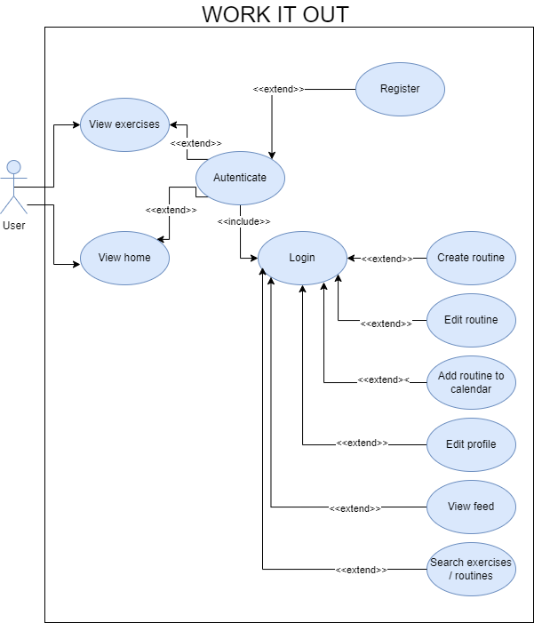

# DEPARTAMENTO DE INFORMÁTICA - I.E.S. PUERTO DE LA CRUZ – TELESFORO BRAVO 
***
### MÓDULO DEL PROYECTO (PRW)
### C.F.G.S. Desarrollo de Aplicaciones Web (DAW) 

TRABÁJALO

<right>

***Autor/es del proyecto: Kelpy Gómez y Andrés González***  
***Fecha: 5 de marzo de 2024***  
***Tutor: Alejandro Martín Zarza***

</right>

# ÍNDICE

1. [***INTRODUCCIÓN.***](#id1)
2. [***ORIGEN, CONTEXTUALIZACIÓN Y JUSTIFICACIÓN DEL PROYECTO.***](#id2)
3. [***PROPÓSITO GENERAL DEL PROYECTO.***](#id3)
4. [***DESCRIPCIÓN GENERAL DEL PROYECTO (ÁMBITO).***](#id4)
5. [***TAREAS.***](#id5)
6. [***CRONOGRAMA.***](#id6)
7. [***RESUMEN DE LOS RECURSOS HUMANOS Y MATERIALES.***](#id7)
8. [***CONTROL DE RIESGOS.***](#id8)
9. [***POLÍTICA DE MONITOREO, EVALUACIÓN Y CONTROL DE CALIDAD.***](#id9)
10. [***CLAÚSULAS.***](#id10)
11. [***BIBLIOGRAFÍA.***](#id11)
12. [***GLOSARIO.***](#id12)
13. [***ANEXOS.***](#id13)

### 1. INTRODUCCIÓN. 

El propósito principal de este documento es proporcionar una guía detallada para la planificación, ejecución y seguimiento del proyecto de desarrollo de la aplicación "WorkItOut". Contiene información relevante para todas las partes involucradas en el proyecto, desde los equipos de desarrollo hasta los patrocinadores y usuarios finales. El documento busca asegurar una comprensión clara de los objetivos del proyecto, el alcance, las tareas, los recursos, los riesgos y las políticas de control de calidad, así como establecer un marco para la gestión eficiente del proyecto. También sirve como referencia central para tomar decisiones, resolver problemas y evaluar el progreso del proyecto a lo largo del ciclo de vida del mismo.

### 2. ORIGEN, CONTEXTUALIZACIÓN Y JUSTIFICACIÓN DEL PROYECTO. 

La idea del proyecto "WorkItOut" surgió de un reconocimiento del creciente interés en la aptitud física y el bienestar entre las personas en todo el mundo. A medida que los estilos de vida modernos se vuelven más sedentarios, hay una conciencia creciente sobre la importancia del ejercicio regular y el mantenimiento de un estilo de vida saludable. Sin embargo, muchas personas tienen dificultades para crear y adherirse a rutinas de ejercicios efectivas debido a la falta de orientación, motivación y recursos.

El proyecto "WorkItOut" tiene como objetivo abordar estas necesidades y desafíos mediante el desarrollo de una aplicación web integral que sirva como una solución integral para las personas que buscan mejorar su estado físico y bienestar. Al ofrecer características como un diario de entrenamiento, un creador de rutinas, una base de datos de ejercicios y una comunidad de usuarios, el proyecto busca capacitar a los usuarios con el conocimiento, las herramientas y el apoyo que necesitan para alcanzar sus objetivos de fitness de manera efectiva. A través de este proyecto, nuestro objetivo es promover una cultura de salud y bienestar, ayudando a las personas a llevar vidas más felices y saludables.

### 3. PROPÓSITO GENERAL DEL PROYECTO. 

El objetivo principal del proyecto es desarrollar una aplicación web integral llamada "WorkItOut" destinada a capacitar a las personas para mejorar su estado físico y bienestar general. El propósito principal es proporcionar a los usuarios una plataforma fácil de usar que ofrezca una amplia gama de herramientas, recursos y apoyo para ayudarles a planificar, rastrear y alcanzar sus objetivos de fitness de manera efectiva.

### 4. DESCRIPCIÓN GENERAL DEL PROYECTO (ÁMBITO). 

Aquí se describe el proyecto con cierto nivel de detalle, se puede tomar como referencia el anteproyecto. Se indica cómo va a funcionar la aplicación en general, las partes en las que se va a dividir, qué arquitectura o estructura se va a emplear, tecnologías que se van a usar (por ejemplo, con qué se va a validar los datos, cómo se hará el inicio de sesión, etc).
- Crear una aplicación web fácil de usar accesible desde varios dispositivos, incluidos ordenadores de sobremesa, tabletas y teléfonos inteligentes.
- Proporcionar a los usuarios un diario de entrenamiento donde puedan planificar, rastrear y monitorear sus rutinas de ejercicio y progreso a lo largo del tiempo.
- Desarrollar una herramienta de "creador de rutinas" que permita a los usuarios crear rutinas de ejercicio personalizadas adaptadas a sus objetivos específicos, preferencias y niveles de aptitud.
- Ofrecer una base de datos completa de ejercicios con descripciones detalladas e instrucciones para guiar a los usuarios en la realización de ejercicios correctamente y de manera segura.
- Facilitar la interacción social y la participación comunitaria permitiendo a los usuarios compartir sus rutinas de ejercicio, experiencias y progreso con otros, así como seguir y apoyar los viajes de fitness de los demás.
- Capacitar a los usuarios con conocimientos y recursos para tomar decisiones informadas sobre su estado físico y bienestar, incluidos consejos, artículos y consejos de expertos sobre ejercicio, nutrición y hábitos de vida saludables.

### 5. TAREAS. 

  
#### *SEMANA UNO*

  
| Tarea      | Título                   | Dependencia  | Duración | Fecha de inicio | Fecha de finalización  |
|-----------|-------------------------|---------|----------|-----------|-----------|
| **Tarea 1**    | **Documentación**          |         | 2h       | 4/3/24    | 10/3/24   |
| Tarea  1.1 | #1 Borrador preliminar    |         | 1 h      | 4/3/24    | 5/3/24    |
| Tarea  1.2 | #2 Documento del proyecto     |         | Indefinido| 4/3/24    | 16/5/24   |
| **Tarea 2**    | **Análisis y diseño de la aplicación** |      | 23 h      | 5/3/24   | 10/3/24   |
| Tarea 2.1  | #3 Especificación de casos de uso |      | 3 h      | 5/3/24   | 6/3/24   |
| Tarea 2.2  | #5 Diagrama de clases |  2.1    | 3 h      | 6/3/24   | 8/3/24   
| Tarea 2.3  | #6 Definición de maquetas |   2.4   | 15 h      | 7/3/24   | 10/3/24   |
| Tarea 2.4  | #7 Páginas de maquetas - Breadcrumbs |      | 2 h      | 7/3/24   | 10/3/24   |
| **Tarea 3**    | **Base de datos** |      | 4 h      | 5/3/24   | 8/3/24   |
| Tarea 3.1  | #4 Diagrama E/R |      | 2 h      | 5/3/24   | 7/3/24   |
| Tarea 3.2  | #8 Diagrama MR |  3.1  | 2 h      | 7/3/24   | 8/3/24   |

  
#### *SEMANA DOS*

  
| Tarea      | Título                   | Dependencia  | Duración | Fecha de inicio | Fecha de finalización  |
|-----------|-------------------------|---------|----------|-----------|-----------|
| **Tarea 4**    | **Implementación de la aplicación**          |         | 19h       | 10/3/24    | 17/3/24   |
| Tarea  4.1 | #9 Crear nuevo proyecto de Django   |         | 1 h      | 10/3/24    | 11/3/24    |
| Tarea  4.2 | #10 Definición de aplicaciones del proyecto     |    4.1     | 2 h| 10/3/24    | 11/3/24   |
| Tarea  4.3 | #11 Definición de modelos del proyecto    |    4.1, 4.2     | 4 h      | 11/3/24    | 13/3/24    |
| Tarea  4.4 | #12 Esquema de URLs     |         | 4 h | 12/3/24    | 16/3/24   |
| Tarea  4.5 | #13 'App Account'    |     4.3    | 8 h      | 13/3/24    | 16/3/24    |

  
#### *SEMANA TRES*

  
| Tarea      | Título                   | Dependencia  | Duración | Fecha de inicio | Fecha de finalización  |
|-----------|-------------------------|---------|----------|-----------|-----------|
| **Tarea 4**    | **Implementación de la aplicación**          |         | 19h       | 17/3/24    | 24/3/24   |
| Tarea  4.6 | #14 Diseño de la plantilla base.html   |    4.7    | 4 h      | 17/3/24    | 24/3/24    |
| Tarea  4.7 | #15 Diseño de la plantilla header.html     |        | 4 h | 17/3/24    | 24/3/24   |
| Tarea  4.8 | #16 Diseño del archivo CCS oficial    |    4.6, 4.7    | 6 h      | 17/3/24    | 24/3/24    |
| Tarea  4.9 | #17 Mejora de las plantillas existentes y 'AUTH'    |         | 4 h | 17/3/24    | 24/3/24   |
| Tarea  4.10 | #18 Crear la API de la aplicación 'ACCOUNT'    |        | 1 h      | 17/3/24    | 24/3/24    |

### *SEMANA CUATRO*

| Tarea      | Título                   | Dependencia  | Duración | Fecha de inicio | Fecha de finalización  |
|-----------|-------------------------|---------|----------|-----------|-----------|
| **Tarea 4**    | **Implementación de la aplicación**          |         | 29h       | 24/3/24    | 31/3/24   |
| Tarea  4.11 | #19 Crear API de Exercises  |        | 2 h      | 24/3/24    | 31/3/24    |
| Tarea  4.12 | #20 Crear nueva página para lista de ejercicios     |        | 6 h | 24/3/24    | 31/3/24   |
| Tarea  4.13 | #21 Crear nueva página para detalle de ejercicios    |        | 6 h      | 24/3/24    | 31/3/24    |
| Tarea  4.14 | #22 Crear nueva página para perfil     |         | 4 h | 24/3/24    | 31/3/24   |
| Tarea  4.15 | #23 Crear nueva página para editar perfil    |        | 4 h      | 24/3/24    | 31/3/24    |
| Tarea  4.16 | #24 Implementar estilos con SCSS en las VISTAS de ejercicios    |        | 5 h      | 24/3/24    | 31/3/24    |

### *SEMANAS CINCO, SEIS Y SIETE*

| Tarea      | Título                   | Dependencia  | Duración | Fecha de inicio | Fecha de finalización  |
|-----------|-------------------------|---------|----------|-----------|-----------|
| **Tarea 4**    | **Implementación de la aplicación**          |         | 29h       | 1/4/24    | 21/4/24   |
| Tarea  4.17 | #25 Añadir ejercicios a la base de datos   |        | 2 h      | 1/4/24    | 21/4/24    |
| Tarea  4.18 | #26 Crear nueva página para lista de rutinas     |        | 6 h | 1/4/24    | 21/4/24   |
| Tarea  4.19 | #27 Crear nueva página para creador de rutinas    |        | 6 h      | 1/4/24    | 21/4/24    |
| Tarea  4.20 | #28 Crear un paginador en cada vista de lista     |         | 4 h | 1/4/24    | 21/4/24   |
| Tarea  4.21 | #29 Desplegar la aplicación en Azure VPS    |        | 4 h      | 1/4/24   | 21/4/24    |

### *SEMANA OCHO*

| Tarea      | Título                   | Dependencia  | Duración | Fecha de inicio | Fecha de finalización  |
|-----------|-------------------------|---------|----------|-----------|-----------|
| **Tarea 4**    | **Implementación de la aplicación**          |         | 29h       | 1/4/24    | 21/4/24   |
| Tarea  4.22 | #30 Crear la vista de calendario   |        | 18 h      | 21/4/24    | 27/4/24    |
| Tarea  4.23 | #31 Revisar los modelos para corregir algunos problemas    |        | 10 h | 21/4/24    | 27/4/24   |
| Tarea  4.24 | #34 Diseñar la página de inicio  |        | 7 h      | 22/4/24    | 28/4/24    |
| Tarea  4.25 | #35 Corregir 'editar-perfil' para que se recargue después de guardar cambios   |         | 1 h | 26/4/24    | 26/4/24   |
| Tarea  4.26 | #36 Corregir 'editar-perfil' para que muestre errores para el usuario   |        | 2 h      | 25/4/24   | 26/4/24    |
| Tarea  4.27 | #37 Mejorar 'perfil' y 'editar-perfil'  |        | 10 h      | 25/4/24   | 28/4/24    |
| Tarea  4.28 | #38 Mejorar 'inicio de sesión' y 'registro'  |        | 3 h      | 5/5/24   | 5/5/24    |
| Tarea  4.29 | #40 Crear y diseñar la Calculadora de IMC  |        | 8 h      | 5/5/24   | 9/5/24    |

### 6. CHRONOGRAM. 
#### *SEMANA 1*
  
 
#### *SEMANA 2*
 

 #### *SEMANA 3*
 

  #### *SEMANA 4*

  

  #### *SEMANA 5, 6 Y 7*

  #### *SEMANA 8*

Aquí está la traducción sin modificar el formato:

### 7. RESUMEN DE RECURSOS HUMANOS Y MATERIALES. 

  #### *Tarea 1: Documentación*

| TAREA                 | RECURSOS HUMANOS                                    | RECURSOS MATERIALES                            |
|----------------------|----------------------------------------------------|-----------------------------------------------|
| 1.1 Borrador Preliminar| Escritor Técnico: 1 | Computadora |
| 1.2 Documento del Proyecto | Escritor Técnico: 1 | Computadora                                        |

  #### *Tarea 2: Análisis y diseño de la aplicación*

| TAREA                 | RECURSOS HUMANOS                                    | RECURSOS MATERIALES                            |
|----------------------|----------------------------------------------------|-----------------------------------------------|
| 2.1 Especificación de casos de uso| Analista de Negocios: 1 | Computadora |
| 2.2 Diagrama de Clases | Arquitecto de Software: 1 | Computadora                                        |
| 2.3 Definición de maquetas | Diseñador UX: 1 | Software de diseño                                       |
| 2.4 Migas de pan de las páginas de maquetas | Diseñador UX: 1 | Software de diseño                                       |

  #### *Tarea 3: Base de Datos*

| TAREA                 | RECURSOS HUMANOS                                    | RECURSOS MATERIALES                            |
|----------------------|----------------------------------------------------|-----------------------------------------------|
| 3.1 Diagrama E/R| Administrador de Bases de Datos: 1 | Software de diseño de base de datos |
| 3.2 Diagrama MR | Administrador de Bases de Datos: 1 | Software de diseño de base de datos |

#### *Tarea 4: Implementación de la aplicación*

| TAREA                 | RECURSOS HUMANOS                                    | RECURSOS MATERIALES                            |
|----------------------|----------------------------------------------------|-----------------------------------------------|
| 4.1 Crear nuevo proyecto de Django | Desarrollador Python: 1 | Computadora + IDE |
| 4.2 Definición de aplicaciones del proyecto | Desarrollador Python: 1 | Computadora + IDE |
| 4.3 Definición de Modelos del Proyecto | Desarrollador Python: 1 | Computadora + IDE |
| 4.4 Esquema de URLs | Desarrollador Python: 1 | Computadora + IDE |
| 4.5 Aplicación 'Account' | Desarrollador Python: 1 | Computadora + IDE |
| 4.6 Diseño de la plantilla base.html | Desarrollador Python: 1 | Computadora + IDE |
| 4.7 Diseño de la plantilla header.html | Desarrollador Python: 1 | Computadora + IDE |
| 4.8 Definición de Modelos del Proyecto | Desarrollador Python: 1 | Computadora + IDE |
| 4.9 Mejorar las plantillas existentes y 'AUTH' | Desarrollador Python: 1 | Computadora + IDE |
| 4.10 Crear la API de la aplicación 'ACCOUNT' | Desarrollador Python: 1 | Computadora + IDE |
| 4.11 Crear API de Ejercicios | Desarrollador Python: 1 | Computadora + IDE |
| 4.12 Crear nueva página para lista de ejercicios | Desarrollador Python: 1 | Computadora + IDE |
| 4.13 Crear nueva página para detalle de ejercicio | Desarrollador Python: 1 | Computadora + IDE |
| 4.14 Crear nueva página para perfil | Desarrollador Python: 1 | Computadora + IDE |
| 4.15 Crear nueva página para editar perfil | Desarrollador Python: 1 | Computadora + IDE |
| 4.16 Implementar estilos con SCSS en las VISTAS de ejercicios | Desarrollador Python: 1 | Computadora + IDE |
| 4.17 Agregar ejercicios a la base de datos | Desarrollador Python: 1 | Computadora + IDE |
| 4.18 Crear nueva página para lista de rutinas | Desarrollador Python: 1 | Computadora + IDE |
| 4.19 Crear nueva página para generador de rutinas | Desarrollador Python: 1 | Computadora + IDE |
| 4.20 Crear un paginador en cada vista de lista | Desarrollador Python: 1 | Computadora + IDE |
| 4.21 Desplegar la aplicación en Azure VPS | Desarrollador Python: 1 | Computadora + IDE |
| 4.22 Crear la vista de calendario | Desarrollador Python: 1 | Computadora + IDE |
| 4.23 Revisar los modelos para corregir algunos problemas | Desarrollador Python: 1 | Computadora + IDE |
| 4.24 Diseñar la página 'inicio' | Desarrollador Python: 1 | Computadora + IDE |
| 4.25 Corregir 'editar-perfil' para que se recargue después de guardar cambios | Desarrollador Python: 1 | Computadora + IDE |
| 4.26 Corregir 'editar-perfil' para que muestre errores para el usuario | Desarrollador Python: 1 | Computadora + IDE |
| 4.27 Mejorar 'perfil' y 'editar-perfil' | Desarrollador Python: 1 | Computadora + IDE |
| 4.28 Mejorar 'inicio de sesión' y 'registro' | Desarrollador Python: 1 | Computadora + IDE |
| 4.29 Crear y diseñar la Calculadora de IMC | Desarrollador Python: 1 | Computadora + IDE |

### 8. CONTROL DE RIESGOS. 

**Riesgo Técnico: Problemas de Compatibilidad con APIs de Terceros**
- Probabilidad: Media (0.50)
- Impacto: Alto (0.80) → Disrupción en el desarrollo, potencial reescritura de código, retraso de más de 2 semanas en el proyecto y un aumento en el costo.
- Tipo de Riesgo: Alto
- Acción a Tomar: Plan de Mitigación → Monitorizar regularmente la compatibilidad con APIs de terceros durante el desarrollo. Tener opciones de respaldo o soluciones alternativas listas para implementar si surgen problemas de compatibilidad.

**Riesgo de Recursos: Incapacidad de Miembro Clave del Equipo**
- Probabilidad: Baja (0.20)
- Impacto: Alto (0.70) → Pérdida de conocimientos y experiencia críticos, interrupción en el cronograma del proyecto, retraso de más de 2 semanas en el proyecto y un aumento en el costo.
- Tipo de Riesgo: Medio
- Acción a Tomar: Plan de Contingencia → Desarrollar y mantener documentación integral de tareas y procesos clave. Capacitar de manera cruzada a los miembros del equipo para garantizar redundancia en roles críticos. Establecer un plan de transición para la transferencia de conocimientos en caso de incapacidad temporal del miembro del equipo. Evaluar regularmente el ánimo del equipo y abordar cualquier problema rápidamente para reducir la probabilidad de incapacidad.

**Riesgo Operacional: Tiempo de Inactividad del Servidor**
- Probabilidad: Media (0.40)
- Impacto: Medio (0.60) → Pérdida temporal de acceso a la aplicación, interrupción en la entrega del servicio, pérdida potencial de usuarios, retraso de hasta 1 semana en el proyecto y un aumento del 10% en el costo.
- Tipo de Riesgo: Medio
- Acción a Tomar: Plan de Contingencia → Implementar una arquitectura de servidor redundante para minimizar el riesgo de tiempo de inactividad. Monitorizar regularmente el rendimiento del servidor e implementar medidas de mantenimiento proactivo para prevenir problemas. Tener un plan de respaldo listo para restaurar rápidamente el servicio en caso de tiempo de inactividad. Comunicarse eficazmente con los usuarios sobre el mantenimiento planificado y el tiempo de inactividad para minimizar el impacto en su experiencia.

### 9. POLÍTICA DE MONITOREO, EVALUACIÓN Y CONTROL DE CALIDAD. 

Para asegurar que nuestro proyecto se mantenga en curso y cumpla con los objetivos establecidos, se implementarán las siguientes acciones:

- **Reuniones de Progreso Regulares:** Se realizarán reuniones de progreso semanales para revisar el estado de cada tarea, identificar cualquier problema o desafío, y discutir posibles soluciones. Se asignarán nuevas tareas en cada reunión.

- **Seguimiento y Reporte de Tareas:** Se utilizará un sistema centralizado de gestión de proyectos para realizar un seguimiento del progreso de cada tarea, incluyendo fechas de inicio y finalización, dependencias y miembros del equipo responsables.

- **Pruebas de Aseguramiento de Calidad:** Se realizarán pruebas de aseguramiento de calidad exhaustivas durante todo el proceso de desarrollo para identificar y rectificar cualquier defecto o problema en la aplicación. Esto incluirá pruebas unitarias, pruebas de integración, pruebas de regresión y pruebas de aceptación de usuario. Se desarrollarán casos de prueba basados en requisitos funcionales y no funcionales, y los resultados de las pruebas se documentarán para su análisis y mejora.

- **Monitoreo y Optimización del Rendimiento:** Se monitorizarán continuamente las métricas de rendimiento para evaluar el rendimiento y la escalabilidad de la aplicación. Se implementarán técnicas de optimización de rendimiento de forma iterativa para mejorar la eficiencia y la capacidad de respuesta de la aplicación.

### 10. CLÁUSULAS. 
**Alcance del Trabajo:**
El equipo de desarrollo se compromete a entregar una solución de software que incluya una interfaz fácil de usar, funcionalidades de sistema actualizables y gestión de clientes, según lo establecido en las especificaciones del proyecto.

**Cronogramas y Hitos:**
El cronograma del proyecto consistirá en hitos y plazos, siendo el primer hito, completar los esquemas y maquetas de diseño, que se logrará en un plazo de 10 días a partir de la fecha efectiva de este acuerdo.

**Propiedad Intelectual:**
El cliente retendrá la propiedad completa del software y todos los derechos de propiedad intelectual asociados una vez finalizado el proyecto.

**Confidencialidad:**
Ambas partes acuerdan mantener toda la información relacionada con el proyecto, secretos comerciales y datos propietarios confidenciales durante y después de la finalización del proyecto.

**Términos de Pago:**
El cliente pagará al equipo de desarrollo el 50% del costo total del proyecto al completarse la fase inicial de desarrollo, y el saldo restante se pagará al entregar el proyecto.

**Garantía y Soporte:**
El equipo de desarrollo proporcionará correcciones de errores y soporte técnico durante un período de tres meses después de la entrega final del proyecto, sujeto a los términos establecidos en las disposiciones de garantía.

**Pruebas de Aceptación:**
El cliente tendrá 10 días hábiles para realizar pruebas de aceptación y notificar al equipo de desarrollo cualquier defecto o problema. Una vez completadas con éxito las pruebas de aceptación, el software se considerará aceptado por el cliente.

### 11. BIBLIOGRAFÍA. 
<a href="https://adevait.com/blog/startups/write-brief-for-software-project">Cómo Escribir un Breve para un Proyecto de Software</a>

<a href="https://niftypm.com/blog/what-is-project-scope/">¿Qué es el Alcance del Proyecto?</a>

<a href="https://docs.github.com/en/issues/tracking-your-work-with-issues/planning-and-tracking-work-for-your-team-or-project">Planificación y Seguimiento del Trabajo para tu Equipo</a>

<a href="https://law-aka.com/essential-clauses-for-a-software-development-agreement/">Cláusulas Esenciales para un Acuerdo de Desarrollo de Software</a>

### 12. GLOSARIO. 
- **Interfaz Amigable para el Usuario:** Una interfaz diseñada para ser fácil de usar y entender, típicamente caracterizada por una navegación intuitiva, un diseño claro y una complejidad mínima.

- **Sistema de Procesamiento de Pagos:** Un sistema que facilita la transferencia electrónica de fondos entre partes, típicamente utilizado para procesar pagos por bienes o servicios.

- **Funcionalidades de Gestión de Clientes:** Funciones y herramientas diseñadas para gestionar las interacciones con los clientes, incluido el software de gestión de relaciones con los clientes (CRM), sistemas de soporte al cliente y canales de comunicación.

- **Esquema:** Una representación visual del diseño y la estructura de una página web o aplicación, típicamente creada en las primeras etapas del proceso de diseño para describir los elementos y la funcionalidad básica.

- **Maquetas de Diseño:** Representaciones visuales detalladas de la interfaz de usuario y el diseño visual de una página web o aplicación, utilizadas para demostrar el aspecto y la sensación del producto final.

- **Diagrama de Clases:** Un tipo de diagrama UML (Lenguaje Unificado de Modelado) que representa la estructura y las relaciones de clases dentro de un sistema, incluidos atributos, métodos y asociaciones.

- **Migas de Pan de las Páginas de Maquetas:** Un sistema de navegación utilizado en interfaces de usuario para indicar la ubicación del usuario dentro de la jerarquía de la aplicación o el sitio web.

- **Diagrama E/R (Diagrama Entidad-Relación):** Una representación visual de las entidades (objetos o conceptos) y sus relaciones en una base de datos, típicamente utilizado para diseñar y comprender la estructura de una base de datos.

- **Diagrama MR (Diagrama Relacional Modificado):** Un tipo de diagrama de base de datos que representa las tablas, columnas y relaciones en un sistema de gestión de bases de datos relacionales (RDBMS).

- **Correcciones de Errores:** Correcciones o modificaciones realizadas al código de software para resolver errores, defectos o problemas identificados durante las pruebas o el uso.

- **Soporte Técnico:** Asistencia proporcionada a los usuarios de un producto de software para ayudarles a resolver problemas técnicos o dificultades encontradas durante el uso del software.

- **Pruebas de Aceptación:** El proceso de evaluación de un producto de software para determinar si cumple con los requisitos especificados y está listo para su implementación o lanzamiento.

- **Arquitectura de Servidor Redundante:** Una configuración que incluye múltiples servidores o componentes de servidor diseñados para garantizar el funcionamiento continuo y minimizar el tiempo de inactividad en caso de fallos de hardware u otros problemas.

- **Métricas de Rendimiento:** Medidas cuantitativas utilizadas para evaluar el rendimiento y la eficiencia de un sistema de software, incluyendo factores como el tiempo de respuesta, la capacidad y la utilización de recursos.

- **Pruebas de Aseguramiento de Calidad:** Un proceso sistemático de evaluación de la calidad y corrección de un producto de software para identificar defectos o problemas que puedan afectar su funcionalidad, confiabilidad o usabilidad.

### 13. ANEXOS. 
#### *MAQUETAS*
- <a href="/img/Mockups">¡Consulta los diseños de maquetas del proyecto para cada página aquí!</a>

#### *DIAGRAMA DE CASOS DE USO*
</img>
- 
Aquí se agregarán:
- Documentación externa de utilidad
- Modelos de datos
- Diagramas y esquemas
- Diagrama Entidad-Relación o similar.
- Tabla de roles de usuario
- etc.
